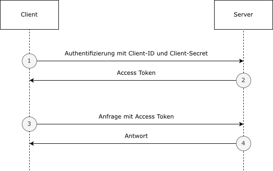

# Authentifizierung

Die API verwendet zur Authentifizierung OAuth2 mit dem Client Credentials Verfahren.
 

Die URL für den Token ist: /oauth/token
 
Um eine Client-ID und ein Client-Secret zu generieren benötigen Sie ein Kundenkonto. 

- Registrierung für das Testsystem unter: https://test-console.psw-group.de
- Registrierung für das Produktivsystem unter: https://www.psw-group.de/console

Im Kundenportal können Sie unter Konfiguration -> API beliebig viele Applikationen anlegen, denen Sie Zugriff auf die Daten Ihres Benutzerkontos geben wollen.

 
