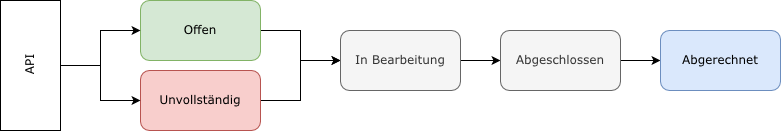

# Allgemeiner Bestellablauf

Per API-Aufruf wird eine Bestellung lediglich entgegengenommen. Die weitere Bearbeitung erfolgt danach asynchron. Das bedeutet, dass nicht sofort Zertifikate beim Zertifizierer erzeugt werden, sondern vorher gegebenenfalls noch Prüfungen durchgeführt oder Rückfragen gestellt werden um fehlende Informationen zu ergänzen.
 
Während der Abwicklung ändert sich der Status einer Bestellung in folgender Reihenfolge:

  
## Status

### Offen

Alle benötigten Daten der Bestellung sind vorhanden. Im Regelfall erfolgt die Freigabe automatisch und die Bestellung wechselt sofort in den Status "In Bearbeitung". Gegebenenfalls wird eine manuelle Prüfung vorgenommen und die Bestellung danach freigegeben.

### Unvollständig

Für die Verarbeitung der Bestellung fehlen noch Informationen, z.B. eine CSR-Datei. Ein Mitarbeiter wird die fehlenden Informationen bei Ihnen anfragen.

### In Bearbeitung

Die Zertifikate werden beim Zertifizierer in Auftrag gegeben. In diesem Schritt erfolgt eine Validierung anhand der gewählten Validerungsmethode.

### Abgeschlossen

Alle Zertifikate einer Bestellung wurden vom Zertifizierer ausgestellt und sind für Sie verfügbar.

### Abgerechnet

Es wurde eine Rechnung für die Bestellung erzeugt. Falls Sie mit Guthaben bezahlen ist der offene Betrag bereits ausgeglichen.

 
